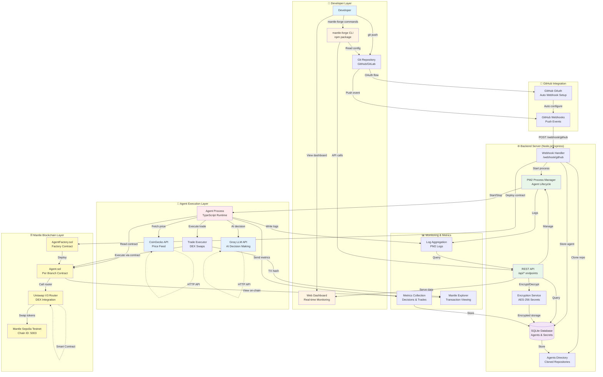
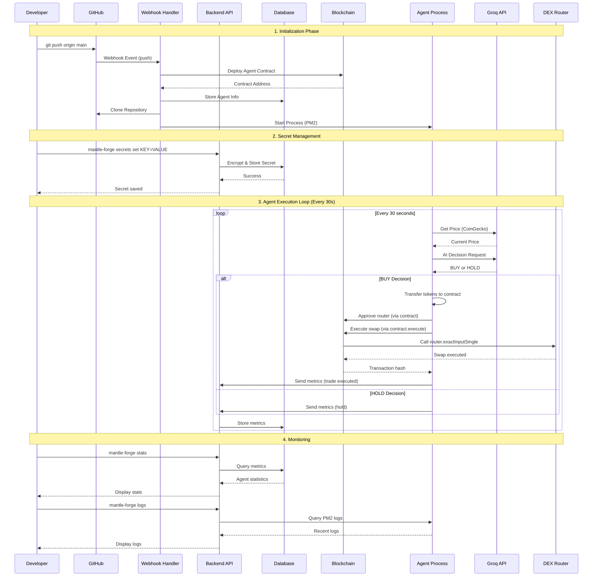
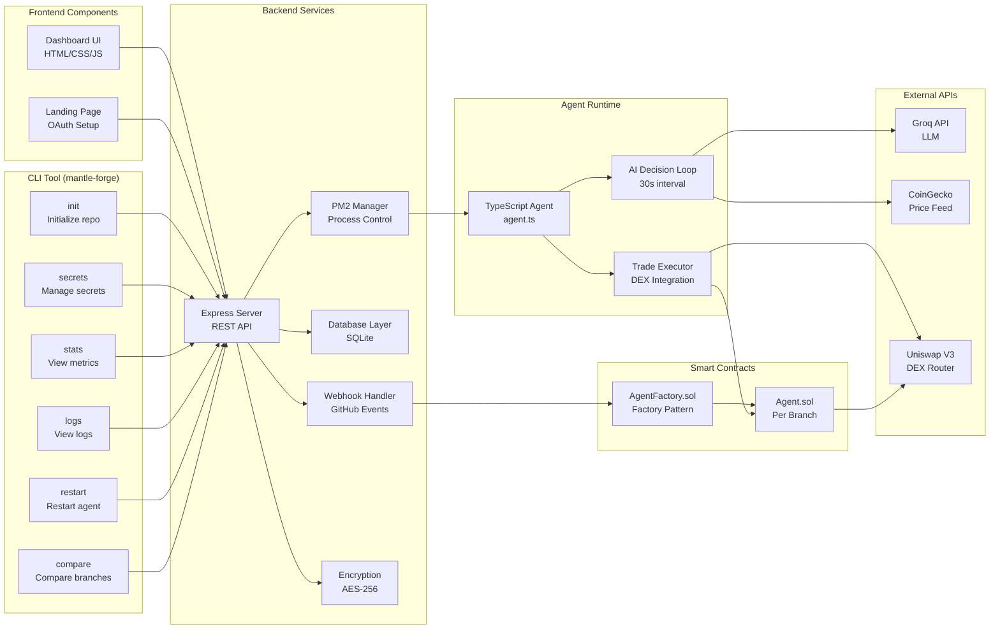
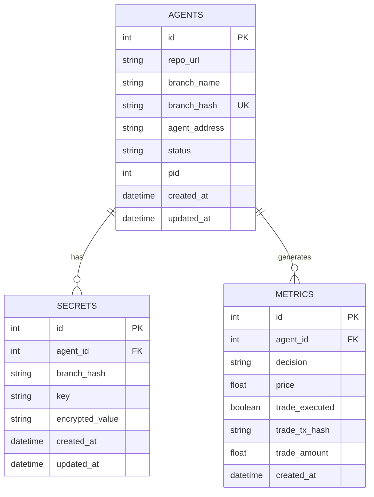

# MantleForge

<div align="center">


</div>


Thnk of it as **Vercel for On-chain Agents**. Deploy autonomous AI agents to Mantle blockchain with a single `git push`. Each branch deploys as a unique smart contract, Enabling truly parallel A/B Testing of Agent Contract Functionalities.

## Important Links

### Repositories
- **[mantle-forge](https://github.com/Mantle-Forge/mantle-forge)** — CLI package repository
- **[mantle-forge-backend](https://github.com/Mantle-Forge/mantle-forge-backend)** — Backend server, dashboard, and agent templates
- **[mantle-forge-contracts](https://github.com/Mantle-Forge/mantle-forge-contracts)** — Smart contracts (AgentFactory.sol, Agent.sol)
- **[mantle-agent-template](https://github.com/Mantle-Forge/mantle-agent-template)** — Demo Trading Agent Template

### Platform & Tools
- **[NPM Package](https://www.npmjs.com/package/mantle-forge)** — Install the CLI tool
- **[Live Dashboard](https://mantle-git-agent.onrender.com/dashboard)** — Monitor deployed agents

### Media & Documentation
- **[Demo Video](https://www.hackquest.io/projects/MantleForge)** — Watch the platform in action
- **[Pitch Video](https://www.hackquest.io/projects/MantleForge)** — Product pitch presentation
- **[Pitch Deck](https://www.canva.com/design/DAG-e0fPpHo/zISCphZMJLZ9s9XChzAR-w/view?utm_content=DAG-e0fPpHo&utm_campaign=designshare&utm_medium=link2&utm_source=uniquelinks&utlId=h81d5a0197d)** — Presentation slides

---

## Overview

MantleForge is a Git-native deployment platform that enables developers to deploy AI agents to the Mantle blockchain through standard Git workflows. The platform abstracts away the complexity of smart contract deployment, infrastructure management, and agent orchestration, providing a deployment experience similar to modern web application platforms.

### Core Concept

Each Git push automatically triggers the deployment of a new smart contract on Mantle, initializes the agent runtime environment, and begins execution. Each Git branch corresponds to a separate agent contract, enabling parallel A/B testing of different strategies.

### Performance Metrics

- **Deployment Time:** 30 seconds from `git push` to live agent
- **Setup Time:** 5 minutes (compared to hours for manual deployment)
- **Cost Reduction:** 90% reduction in deployment overhead compared to manual setup

---

## Value Proposition

### Developer Benefits

- **Rapid Deployment** — 10x faster deployment cycle (30 seconds vs 5+ minutes)
- **Zero Configuration** — No smart contract development knowledge required
- **Cost Efficiency** — 90% reduction in DevOps overhead
- **Parallel Testing** — Deploy multiple strategies simultaneously for A/B testing
- **Enterprise Security** — Encrypted secret management and on-chain identity verification

---

# 🏗️ MantleForge System Architecture

Complete system diagram covering all components, data flows, and interactions in the MantleForge platform.

## 📊 Complete System Architecture Diagram



## 🔄 Complete Data Flow Diagram



## 🏛️ Component Architecture



## 📦 System Components Overview

### 1. **Developer Layer**
- **mantle-forge CLI**: npm package for managing agents
- **Git Repository**: Source code version control
- **Web Dashboard**: Real-time monitoring interface

### 2. **GitHub Integration**
- **Webhooks**: Automatic deployment triggers
- **OAuth**: Automated webhook configuration

### 3. **Backend Server**
- **REST API**: `/api/agents`, `/api/secrets`, `/api/metrics`, `/api/logs`
- **Webhook Handler**: Processes GitHub push events
- **SQLite Database**: Stores agents, secrets, and metrics
- **PM2 Manager**: Process lifecycle management
- **Encryption Service**: AES-256 secret encryption

### 4. **Blockchain Layer (Mantle Sepolia)**
- **AgentFactory.sol**: Factory contract for deploying agents
- **Agent.sol**: Individual agent contracts (one per branch)
- **Uniswap V3 Router**: DEX integration for token swaps

### 5. **Agent Execution**
- **TypeScript Runtime**: Runs agent.ts code
- **AI Decision Loop**: 30-second interval decision making
- **Trade Executor**: Executes swaps via agent contract

### 6. **External Services**
- **Groq API**: LLM for AI decision making
- **CoinGecko API**: Real-time price feeds
- **Mantle Explorer**: Blockchain transaction viewing

## 📊 Database Schema



## 🎯 Key Data Flows

### 1. **Agent Deployment Flow**
```
Git Push → GitHub Webhook → Backend → Deploy Contract → Clone Repo → Start Process
```

### 2. **Secret Management Flow**
```
CLI → API → Encrypt → Database → Decrypt → Inject → Agent Process
```

### 3. **Trading Execution Flow**
```
Price Feed → AI Decision → Transfer Tokens → Approve Router → Execute Swap → Record Metrics
```

### 4. **Monitoring Flow**
```
Agent Metrics → Backend API → Database → Dashboard/CLI
```

## Features

### Git Push to Deploy

- **Automatic Contract Deployment** — Each push creates a new `Agent.sol` contract on Mantle
- **Zero-Config Setup** — No manual deployment scripts or configuration files required
- **Instant Activation** — Agent begins execution within 30 seconds of deployment

### Branch-Based A/B Testing

- **Parallel Strategies** — Each branch deploys as a separate agent contract for true parallel testing
- **Performance Comparison** — CLI tool provides side-by-side strategy comparison
- **Easy Rollback** — `git revert` instantly rolls back to previous strategy
- **Team Collaboration** — Multiple developers can deploy agents from the same repository

### Developer CLI

```bash
npx mantle-forge init          # Initialize repository in 10 seconds
npx mantle-forge secrets set   # Secure secret management
npx mantle-forge stats         # Real-time performance metrics
npx mantle-forge logs          # Live agent decisions and trades
npx mantle-forge compare       # Side-by-side strategy comparison
```

### On-Chain Agent Registry

- **Immutable Identity** — Every agent has a unique Mantle contract address
- **Blockchain-Backed** — Agent registry persists independently of backend infrastructure
- **Recovery-Proof** — Agent addresses can be recovered from blockchain state
- **Transparent** — All agents are visible on Mantle block explorer

### DeFi Integration

- **DEX Swaps** — Agents execute real trades on Mantle-compatible DEXs
- **Token Management** — Each agent contract can hold and manage tokens
- **Automated Trading** — AI-powered decisions execute on-chain automatically
- **Transaction Tracking** — Every trade includes on-chain proof with transaction hash

### Monitoring & Analytics

- **Real-Time Dashboard** — View all agents, metrics, and trades in a unified interface
- **CLI Monitoring** — Check stats and logs directly from your terminal
- **Performance Analytics** — Track decisions, trades, and success rates
- **Transaction Explorer** — Direct links to Mantle block explorer for each transaction

---

## Getting Started

### Prerequisites

- Node.js 18+ and npm
- Git
- GitHub account
- Groq API key ([obtain here](https://console.groq.com))
- Mantle Sepolia testnet tokens

### Installation

#### Step 1: Install CLI Tool

```bash
npm install -g mantle-forge
```

Alternatively, use `npx` without global installation:
```bash
npx mantle-forge --help
```

#### Step 2: Clone Agent Template

```bash
git clone https://github.com/Mantle-Forge/mantle-agent-template.git
cd mantle-agent-template
npx mantle-forge init
```

#### Step 3: Configure Secrets

```bash
npx mantle-forge secrets set GROQ_API_KEY=your-key-here
npx mantle-forge secrets set AGENT_PRIVATE_KEY=0x-your-key-here
```

#### Step 4: Configure Webhook

Visit [https://mantle-git-agent.onrender.com](https://mantle-git-agent.onrender.com) and:
1. Enter your repository URL
2. Authorize GitHub OAuth
3. Webhook is automatically configured

#### Step 5: Deploy Agent

```bash
git push origin main
```

**Deployment Process:**
1. GitHub webhook triggers MantleForge backend
2. Backend deploys `Agent.sol` contract on Mantle Sepolia testnet
3. Agent receives on-chain address (e.g., `0xD8690eD5e80784918504CC85F08b7F4D418cf850`)
4. Backend clones repository, injects secrets, and starts agent process
5. Agent begins making AI decisions every 30 seconds
6. Agent executes trades on Mantle DEX when BUY signals occur

#### Step 6: Monitor Agent

```bash
# Check performance statistics
npx mantle-forge stats
# Output: Decisions: 150, BUY: 45, Trades: 12, Success Rate: 8.3%

# View execution logs
npx mantle-forge logs
# Shows: [2025-11-05] 🟢 BUY - Price: $0.3445

# Access web dashboard
# Visit: https://mantle-git-agent.onrender.com/dashboard
```

#### Step 7: A/B Test Strategies

```bash
# Create new strategy branch
git checkout -b aggressive-strategy
# Modify agent.ts with your strategy
git push origin aggressive-strategy

# Compare strategies
npx mantle-forge compare main aggressive-strategy
```

**Total deployment time:** 5 minutes  
**Traditional manual deployment:** 2-3 hours

---

```
┌─────────────────────────────────────────────────────────────┐
│                    Developer Workflow                       │
│  git push → GitHub → Webhook → MantleForge Backend          │
└─────────────────────────────────────────────────────────────┘
                            ↓
┌─────────────────────────────────────────────────────────────┐
│              Mantle Blockchain Layer                        │
│  AgentFactory.sol → Deploy Agent.sol → On-chain Address     |
│  (0x...)              (0x...)              (0x...)          │
└─────────────────────────────────────────────────────────────┘
                            ↓
┌─────────────────────────────────────────────────────────────┐
│              Backend Processing Layer                       │
│  Clone Repo → Inject Secrets → Start Agent (PM2)            │
│  Store Metrics → Update Database → Serve Dashboard          │
└─────────────────────────────────────────────────────────────┘
                            ↓
┌─────────────────────────────────────────────────────────────┐
│              Agent Execution Layer                          │
│  AI Decision (Groq) → Execute Trade (Mantle DEX)            │
│  Send Metrics → Log Transactions → Update Status            │
└─────────────────────────────────────────────────────────────┘
```

### Core Components

1. **AgentFactory.sol** — Factory contract responsible for deploying Agent contracts ([Contracts Repository](https://github.com/Mantle-Forge/mantle-forge-contracts))
2. **Agent.sol** — Individual agent contracts (one per Git branch) ([Contracts Repository](https://github.com/Mantle-Forge/mantle-forge-contracts))
3. **Backend API** — Handles webhooks, manages agents, stores metrics ([Backend Repository](https://github.com/Mantle-Forge/mantle-forge-backend))
4. **CLI Tool** — Developer interface for secrets, stats, and logs ([CLI Repository](https://github.com/Mantle-Forge/mantle-forge))
5. **Dashboard** — Web UI for monitoring all agents ([Backend Repository](https://github.com/Mantle-Forge/mantle-forge-backend))
6. **Agent Process** — Executes AI logic, makes decisions, executes trades

---

## Deployed Contracts

### AgentFactory Contract

**Address:** `0xffad39924ff5cdaacd04350ed6ee960a2394a065`  
**Explorer:** [View on Mantle Explorer](https://sepolia.mantlescan.xyz/address/0xffad39924ff5cdaacd04350ed6ee960a2394a065#code)  
**Network:** Mantle Sepolia Testnet (Chain ID: 5003)  
**Source Code:** [Contracts Repository](https://github.com/Mantle-Forge/mantle-forge-contracts)

The AgentFactory contract is responsible for deploying and tracking all Agent contracts. Each time a new branch is pushed, the factory deploys a unique `Agent.sol` contract for that branch.

### Example Agent Contracts

Below are example Agent contracts deployed by the AgentFactory on Mantle Sepolia testnet:

| Branch Name | Contract Address | Explorer Link |
|-------------|------------------|---------------|
| **main** | `0xD8690eD5e80784918504CC85F08b7F4D418cf850` | [View Contract](https://sepolia.mantlescan.xyz/address/0xD8690eD5e80784918504CC85F08b7F4D418cf850) |
| **test-agent** | `0x1Fd756bf558BF31b72C37386c74FBAd101bF4835` | [View Contract](https://sepolia.mantlescan.xyz/address/0x1Fd756bf558BF31b72C37386c74FBAd101bF4835) |

Each agent contract supports:
- ✅ Receiving and holding tokens
- ✅ Executing trades on Mantle-compatible DEXs
- ✅ Interacting with any Mantle DeFi protocol
- ✅ Maintaining on-chain identity and transaction history

---

## Setup Instructions

### Prerequisites

- Node.js 18+ and npm
- Git
- GitHub account
- Groq API key ([obtain here](https://console.groq.com))
- Mantle Sepolia testnet tokens

### Quick Start

```bash
# 1. Install CLI
npm install -g mantle-forge

# 2. Clone agent template repository
git clone https://github.com/Mantle-Forge/mantle-forge-backend.git
cd mantle-forge-backend

# 3. Initialize
npx mantle-forge init

# 4. Set secrets
npx mantle-forge secrets set GROQ_API_KEY=your-key-here
npx mantle-forge secrets set AGENT_PRIVATE_KEY=0x-your-key-here

# 5. Configure webhook (automatic)
# Visit: https://mantle-git-agent.onrender.com
# Enter your repository URL and authorize GitHub

# 6. Deploy
git push origin main

# 7. Monitor
npx mantle-forge stats
npx mantle-forge logs
```

Your agent is now live on Mantle Sepolia testnet.

---

## Roadmap

### Agent Marketplace

Pre-built agent templates for common strategies (DeFi arbitrage, yield farming, market making). One-click deployment with community-driven improvements. Fork and customize any agent template.

### Multi-Chain Orchestration

Deploy the same agent across multiple chains (Mantle, Ethereum, Polygon) with unified monitoring. Cross-chain arbitrage opportunities. Single dashboard for all chains.

### Advanced Analytics & ML Optimization

AI-powered parameter tuning. Automatic strategy optimization based on performance metrics. Predictive analytics for trade success rates. Statistical significance testing for A/B tests.

### Enterprise Features

Team collaboration with role-based access control. Custom deployment pipelines. White-label solutions. Enterprise SLA guarantees. Dedicated support and infrastructure.

---

<div align="center">

Built for The Mantle Network

</div>
